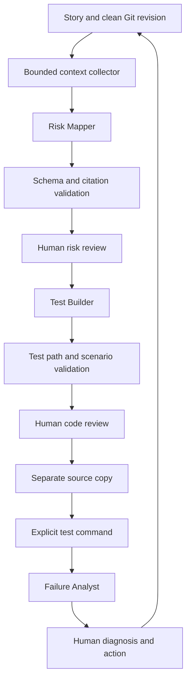

> This page documents the optional Python API/CLI engine. For the default three
> independent native agents, see [NATIVE_AGENTS.md](NATIVE_AGENTS.md).

# Why these agents exist

The original article's useful contribution is repository visibility for QA: map a
business scenario to implementation, inspect existing assertions and choose the
lowest reliable test boundary before writing UI automation.

Risk Mapper implements that idea. Test Builder turns an agreed map into reviewable
test code. Failure Analyst extends the article with failure triage and production
feedback. None of these replaces testability, engineering ownership, environment
stability or explicit time allocated to quality work.

## Implemented architecture

The orchestrator controls state, context and file access. Each agent is a distinct
prompt/schema contract executed as a bounded model invocation. v1 does not expose
a general shell or unrestricted tool loop to the model. For a larger repo, improve
focus patterns or create a second context packet when questions expose missing code.
This trades autonomous exploration for reviewable, reproducible inputs.

## Mechanisms beyond the presentation

1. **Expected behavior is explicit.** Every scenario includes an oracle derived from
   acceptance criteria. Reproducing the existing implementation is not sufficient.
2. **Scope is visible.** Omitted files, context budgets and diff truncation are recorded.
   No agent can credibly assert global coverage from a partial snapshot.
3. **Approval is tied to source.** Git HEAD, story/config and report hashes must match.
   A model cannot mark a proposal reviewed by setting a JSON field.
4. **Execution is separate from generation.** Only actual process execution creates a
   verification result. `suggested_checks` are inert text.
5. **Failures stay failures.** A meaningful regression test exposing a product bug is
   useful; the agent is told not to change the oracle just to obtain green CI.
6. **Uncertainty is permitted.** Unknown coverage and unknown cause are valid results.
   A failed test is not automatically flaky or a product defect.
7. **One tool, many projects.** Per-project JSON config and external output directories
   prevent client material from becoming part of the personal toolkit.

## Modules

| Module | Responsibility |
|---|---|
| `context.py` | Clean revision, Git-tracked source selection, exclusions, redaction, diff, framework hints |
| `schemas.py` | Strict data contracts and local subset validator |
| `prompts/` | Shared quality policy and role-specific reasoning instructions |
| `provider.py` | OpenAI Responses transport, refusal/incomplete handling, usage metadata |
| `workflow.py` | Prepare/import/review/stage/verify and Markdown reporting |
| `cli.py` | User and CI entry point |
| `demo.py` | Explicit offline fixture workflow with real test execution |

## Deliberate v1 boundaries

- OpenAI is the implemented automatic provider. Other assistants use prompt/JSON
  handoff; native Claude/Gemini adapters are not claimed to exist.
- Local Git repository input. Jira, Linear, Slack and CI ingestion start with exported
  text. No live connector or webhook service is claimed.
- Agent output references are checked for valid path and line range. Semantic truth,
  business understanding and adequate test assertions still require human review.
- Test path restrictions prevent accidental production edits under a narrow config.
  They do not inspect every possible malicious behavior inside proposed test code.
- No automatic production-data access, repo push, merge or release decision.
- Approval receipts are local audit records, not a multi-user identity/auth system.
- Small/medium focused context, not whole-company dependency graph analysis.
- The `.github/workflows/ci.yml` gate verifies this TOOLKIT, not a client's application.

## Alignment and sources

The three-role design is our extension of Rahul Shetty's supplied article:
[Shift-left testing in the AI era](https://medium.com/rahulshettyacademy/shift-left-testing-in-the-ai-era-how-coding-agents-can-change-the-qa-engineers-role-397b90b21880).
Analysis used the complete text supplied in the conversation.

API transport uses `text.format` with strict JSON Schema and handles incomplete/refusal
outputs, following [OpenAI Structured Outputs](https://developers.openai.com/api/docs/guides/structured-outputs),
consulted September 9, 2026. Schema-conforming output is not proof of correctness.
