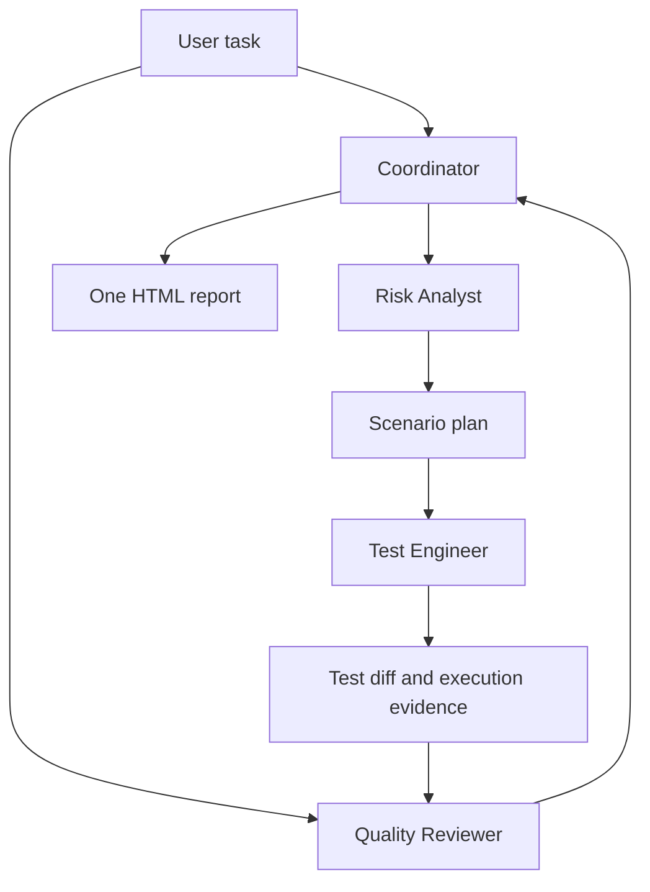

# Native agent execution

The default user experience is a small coordinator entry point around **three
real worker sessions**, not three prompts answered by the same assistant.

Each worker has its own context and host-provided identity. Only Test Engineer
owns test edits. Quality Reviewer receives original requirements and raw evidence
in a fresh context; the writer's self-assessment is not its starting verdict.
The coordinator saves reports returned by read-only workers and reconciles disagreement.

## Components and their jobs

| Component | Responsibility |
|---|---|
| `setup-quality-agents` entry skill | Discover conventions; register native workers |
| `assets/roles.json` in setup skill | Canonical prompts and responsibility boundaries |
| Setup's `install-agents.mjs` | Create three Cursor/Claude Markdown or Codex TOML agent files without overwriting custom definitions |
| `quality-flow` entry skill | Dispatch independent sessions, pass evidence, enforce task scope, consolidate output |
| Host native agent runtime | Actual model execution, separate contexts, tool calls, permissions and usage accounting |
| Flow's `render-report.mjs` | Escape and validate presentation data, produce standalone HTML |
| Existing Python package | Optional API/CI workflow with deterministic packet validation and review receipts |

## Supported adapters

Cursor setup creates `.cursor/agents/qa-*.md` with `model: inherit` and
`is_background: false` for sequential handoffs. Analyst/reviewer use `readonly: true`;
engineer uses normal Agent permissions. Use Cursor Agent with native subagent support.
Its Task delegation starts workers in separate contexts. Customization format follows
[Cursor subagents](https://cursor.com/docs/subagents); live local Cursor execution has
not been performed in this environment.

Claude Code setup creates `.claude/agents/qa-*.md`. Analyst/reviewer receive only
Read, Grep and Glob tools. Engineer has read/write/edit and Bash, constrained by
normal host policy. Models inherit the user's selection. No permission bypass.

Current Codex setup creates `.codex/agents/qa-*.toml`, with `name`, `description` and
`developer_instructions`. Analyst/reviewer request `sandbox_mode = "read-only"`;
engineer inherits the current host policy. Runtime overrides can affect those
settings. No global config is overwritten or silently enabled.

Hosted assistants with native delegation may use three generic agents with explicit
role briefs. This is how the repository's live smoke validation was conducted.
No-agent environments return a blocker instead of pretending role switching is delegation.

## Independence and limits

Separation is by agent context and ownership, not separate machines, guaranteed
statistical independence or separate paid accounts. Shared model biases remain.
The agents run on demand; this release doesn't add scheduling, webhooks or persistent
background services. Project conventions persist as files; model conversations
should not be treated as durable project memory.

The default path uses host permissions and conversational review. The Python path's
hash receipts, snapshot exclusions and staged filesystem checks do not automatically
protect native sessions. The HTML renderer checks data shape, not whether source
citations are true or agent ids are authentic. Verify evidence in the host transcript.

One requested test repair/review round is allowed after the first result; unresolved
issues remain visible. Product failures aren't fixed by weakening regression tests.

## Specification references

Formats checked September 9, 2026 against [Claude Code subagents](https://code.claude.com/docs/en/sub-agents),
[Codex subagents](https://developers.openai.com/codex/multi-agent), and the
[Skills CLI](https://github.com/vercel-labs/skills). Older installed hosts can require
an update/restart. Registration tests and a hosted-agent smoke test are not a claim
that every Claude Code/Codex release was exercised locally.
